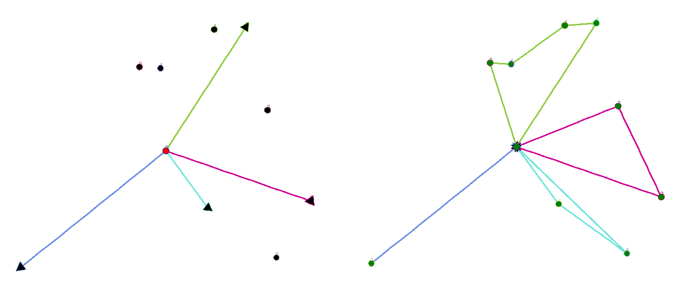

**VRP Simulator:** Python Turtle and Google OR-Tools  
**Author:** Kyle E. C. Booth (kbooth@mie.utoronto.ca) 

This repository contains code base for a lightweight simulator of the vehicle routing problem (VRP). Vehicle movement is simulated using [Python Turtle](https://docs.python.org/3.3/library/turtle.html?highlight=turtle), and vehicle routes are generated using [Google OR-Tools](https://developers.google.com/optimization/routing) routing solver.

### File/directory descriptions:

In progress.

### Running the simulator:

Running the simulator is very easy. Simple navigate to the directory and run the following in terminal:

```console
python main.py `<cycles>` `<vehicles>` `<tasks>`
```

* cycles: indicates the number of times a new VRP instance should be generated, solved, and simulated
* vehicles: the number of agents that are routed
* tasks: the number of customers visited across all vehiles

A Python Turtle window should pop-up and simulate the solution to the VRP, resembling something like the following:


